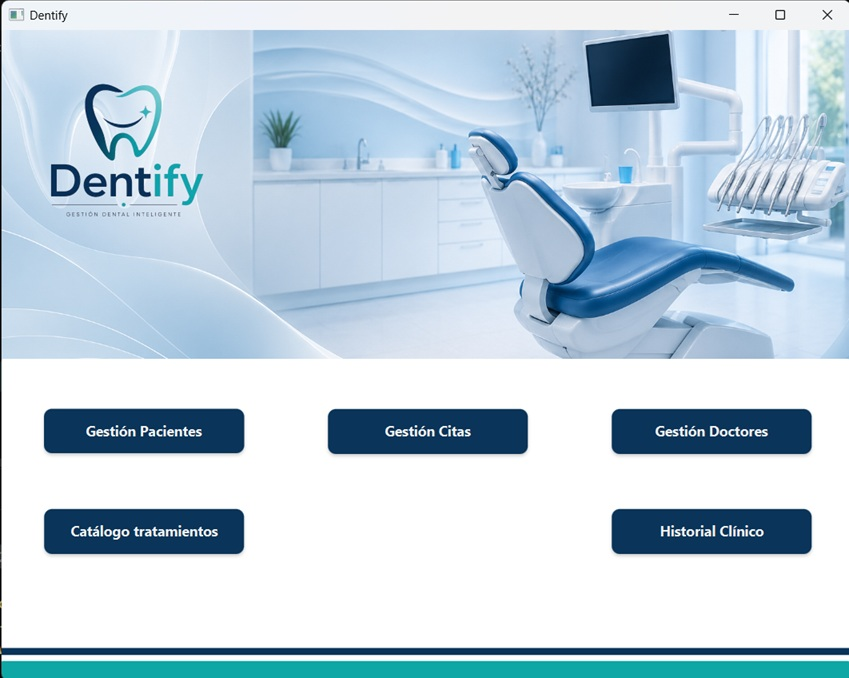
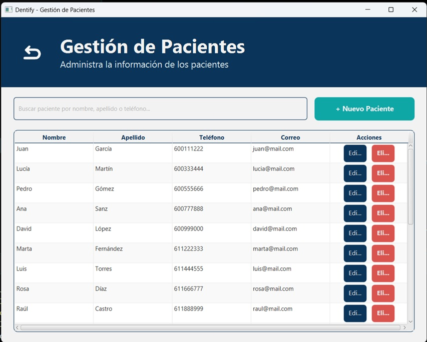
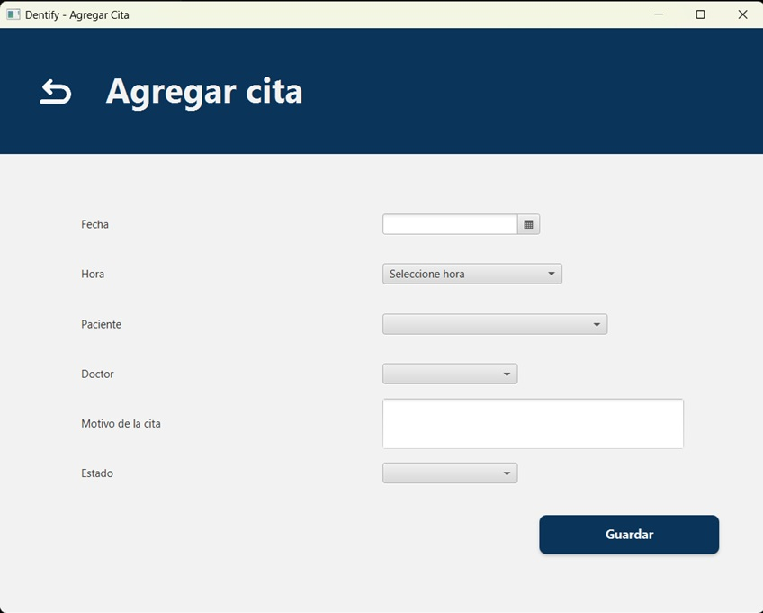
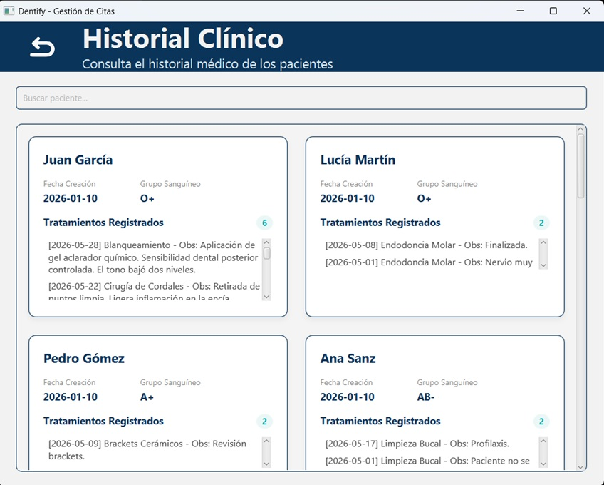

# Dentify Desktop MVC

## Versión en Español

Sistema integral de gestión de escritorio diseñado para clínicas dentales. Esta aplicación se enfoca en optimizar los flujos de trabajo administrativos, aplicar reglas de negocio críticas y administrar el ciclo de vida completo de los datos (CRUD). Desarrollado bajo una estricta arquitectura Modelo-Vista-Controlador (MVC) para garantizar la separación de responsabilidades y un código limpio.

### Características Principales

* **Operaciones CRUD Completas:** Gestión total (Crear, Leer, Actualizar, Eliminar) de Doctores, Pacientes, Tratamientos y Citas.
* **Agenda Inteligente:** Implementación de validaciones robustas en el backend para evitar la duplicidad o choque de citas en el mismo horario o con el mismo especialista.
* **Buscador de Historial Clínico:** Módulo especializado para consultar y agrupar de forma rápida los eventos clínicos y tratamientos recibidos por cada paciente.
* **Persistencia de Datos:** Integración fluida con base de datos relacional MySQL para el manejo de restricciones estructurales y almacenamiento seguro.

### Metodología Ágil y Trabajo en Equipo

Este proyecto se desarrolló de forma colaborativa en un equipo de 3 desarrolladores, adoptando prácticas estándar de la ingeniería de software:
* **Gestión del Proyecto:** Diseñado y administrado bajo principios **Kanban** utilizando **GitHub Projects** para el seguimiento de historias de usuario, tareas e iteraciones.
* **Colaboración y Git Flow:** Uso activo de estrategias de ramificación (branches), estándares de commits y resolución de conflictos para mantener el código fuente estable.

### Arquitectura y Patrones de Diseño

* **Modelo-Vista-Controlador (MVC):** Desacoplamiento estricto entre las estructuras de datos (Modelos), la lógica de negocio (Controladores) y la interfaz de usuario (Vistas FXML).
* **Patrón DAO (Data Access Object):** Interacciones con la base de datos encapsuladas para aislar la persistencia de la lógica del dominio.
* **Integridad Orientada a Objetos:** Modelado limpio de entidades clave como `HistorialClinico`, `Cita` y `Tratamiento`, respetando sus relaciones lógicas.

### Stack Tecnológico

* **Lenguaje:** Java
* **Framework de IU:** JavaFX / FXML (Scene Builder)
* **Base de Datos:** MySQL
* **Gestor de Dependencias:** Apache Maven

### Vista de Módulos

#### Panel Principal

#### Administración de Pacientes

#### Agenda de Citas y Control de Reglas

#### Motor de Búsqueda de Historial Clínico

## English Version

A comprehensive desktop management system designed for dental clinics. This application focuses on optimizing administrative workflows, enforcing strict business rules, and handling complete data lifecycle management (CRUD). Built with a strict Model-View-Controller (MVC) architecture to ensure separation of concerns and maintainable code structures.

### Key Features

* **Complete CRUD Operations:** Full management (Create, Read, Update, Delete) of Doctors, Patients, Treatments, and Appointments.
* **Smart Scheduling System:** Implementation of robust backend validations to prevent overlapping appointments or scheduling conflicts for the same doctor or time slot.
* **Clinical History Search Engine:** Integrated search module to query and aggregate historical clinical events and treatments per patient.
* **Data Persistence:** Seamless integration with a MySQL relational database handling structural constraints and operational data tracking.

### Agile Methodology & Teamwork

This project was developed collaboratively in a team of 3 developers, adopting industry-standard software engineering practices:
* **Project Management:** Designed and managed using **Kanban** principles via **GitHub Projects** to track user stories, tasks, and iterations.
* **Collaboration & Git Flow:** Active use of branching strategies, commit standards, and conflict resolution to maintain stable main source code.

### Architecture & Design Patterns

* **Model-View-Controller (MVC):** Strict decoupling of data structures (Models), business logic (Controllers), and user interface (FXML Views).
* **Data Access Object (DAO) Pattern:** Encapsulated database interactions to isolate persistence logic from the core domain.
* **Object-Oriented Integrity:** Clean data modeling representing entities like `HistorialClinico`, `Cita`, and `Tratamiento` with strict relationship constraints.

### Tech Stack

* **Language:** Java
* **UI Framework:** JavaFX / FXML (Scene Builder)
* **Database:** MySQL
* **Build Tool:** Apache Maven

### Module Previews

#### Main Dashboard

#### Patient Administration

#### Appointment Scheduling & Rules Enforcement

#### Clinical History Search Engine
